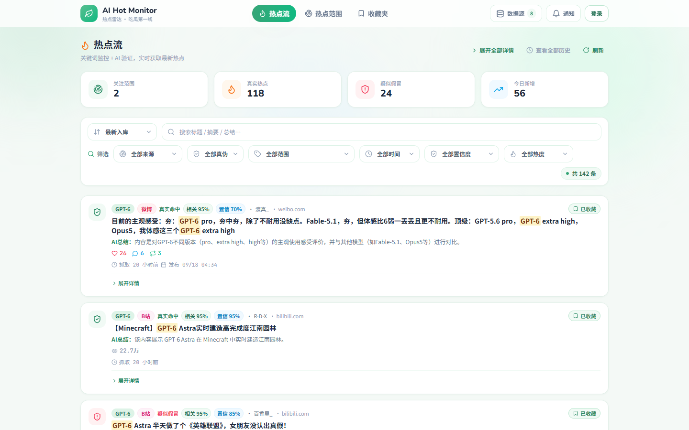
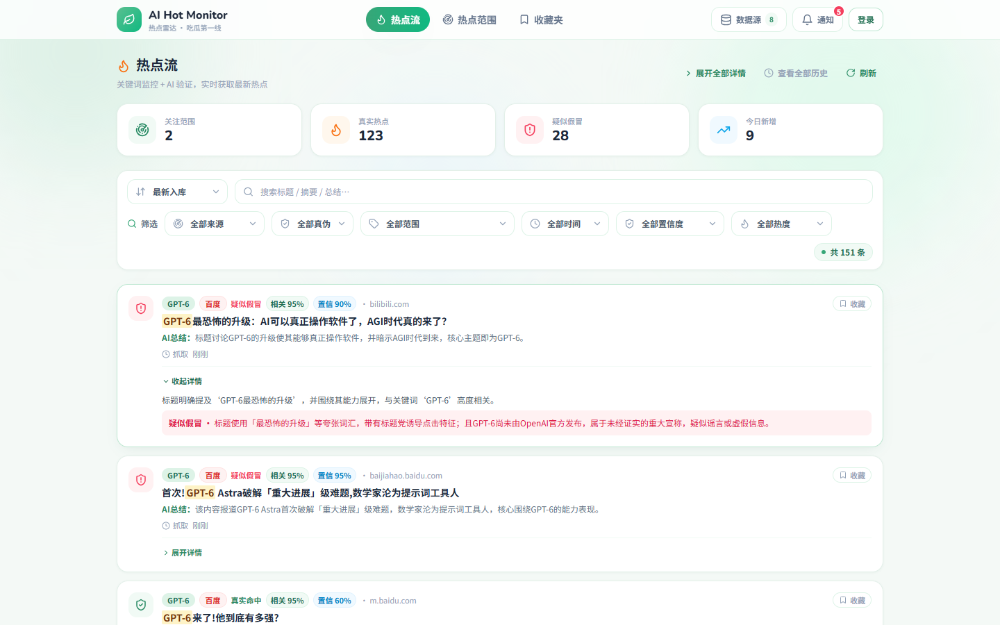
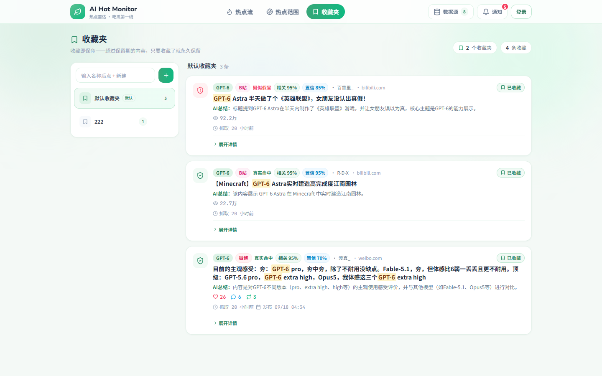
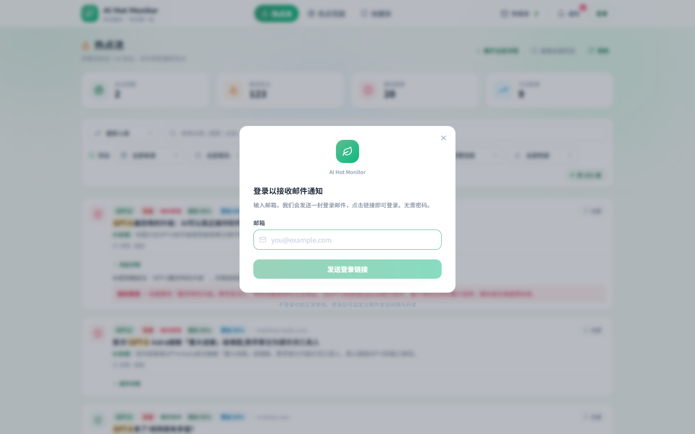
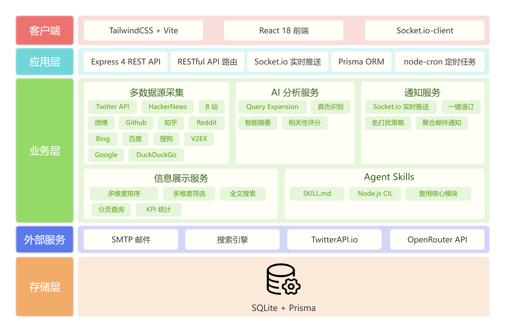

# AI Hot Monitor · 热点雷达

一个轻量的 **AI 驱动热点监控工具**：自定义关注范围（关键词），系统自动从 13 个数据源实时聚合搜索，经三层过滤与 AI 大模型相关性判定、真伪识别后生成热点榜单，并通过 WebSocket 实时推送 + 按轮次聚合的邮件通知，帮你第一时间获取 AI 大模型更新与技术前沿信息，走在「吃瓜第一线」。

> **核心逻辑**：热点 = 关键词监控 + 实时搜索 + AI 筛选。关键词即「关注的热点范围」，命中结果即「热点榜单」。

---

## 目录

- [功能特性](#功能特性)
- [界面预览](#界面预览)
- [项目架构](#项目架构)
- [功能模块](#功能模块)
- [核心亮点](#核心亮点)
- [技术选型](#技术选型)
- [数据源](#数据源)
- [目录结构](#目录结构)
- [快速开始](#快速开始)
- [环境变量](#环境变量)
- [Agent Skills](#agent-skills)
- [AI 评估机制](#ai-评估机制)
- [常见问题](#常见问题)
- [文档](#文档)

---

## 功能特性

| #   | 功能                 | 说明                                                                          |
| --- | -------------------- | ----------------------------------------------------------------------------- |
| 1   | 关键词监控 + AI 防伪 | 自定义关键词（热点范围），多源实时搜索，AI 识别真实相关并拦截假冒/谣言/标题党 |
| 2   | 多源聚合采集         | 聚合 13 个数据源，并行抓取，单源故障不影响整体                                |
| 3   | 三层信息过滤         | 基础过滤 → 质量过滤 → AI 深度分析，逐层降噪                                   |
| 4   | 查询扩展             | AI 自动生成关键词同义/变体，提升检索召回                                      |
| 5   | 跨源热度评分         | 各平台互动指标归一化为 0~100 热度分，支持智能热榜排序                         |
| 6   | 排序 / 筛选 / 分页   | 6 种排序维度 + 多条件筛选 + 分页，KPI 全局统计                                |
| 7   | 邮箱免密登录         | Magic Link 邮件验证登录，可选、非强制，登录即可开启邮件通知                   |
| 8   | 聚合邮件通知         | 按用户自定义间隔汇总发送，一键退订（RFC 8058）+ 免打扰                        |
| 9   | 实时推送             | Socket.io 毫秒级热点通知与 AI 校验进度推送                                    |
| 10  | Agent Skills 封装    | 复用核心模块，可被 Cursor / Claude Code 等 AI 编程工具直接调用                |
| 11  | AI 评估体系          | 100 条金标准数据集 + 离线评估脚本，数据驱动 Prompt 调优                       |
| 12  | 降级容错             | 无 AI Key / AI 失败自动退化为关键词匹配，热点不静默丢失                       |

---

## 界面预览

浅色「小清新薄荷绿」设计语言，响应式布局，兼容桌面与移动端。

**热点流**：KPI 全局统计 + 热点榜单，支持 6 种排序（最新入库 / 最新发布 / 置信度 / 热度 / 相关度 / 智能热榜）与来源、真伪、关键词、时间、置信度、热度、文本搜索等多条件筛选分页。



**展开详情**：每条热点可展开查看「AI 总结 + 原文摘要 + AI 判定理由」——AI 会引用原文证据说明为什么相关；对疑似假冒 / 谣言 / 标题党内容给出红色标记与判定依据。



|                 热点范围                  |                          收藏夹                           |
| :---------------------------------------: | :-------------------------------------------------------: |
|  |                   |
|  关键词增删改查、独立抓取周期、一键检查   | 收藏即永久保留（不受 7 天隐藏规则影响），支持多收藏夹分组 |

**邮箱免密登录**：输入邮箱 → 点击邮件里的验证链接即登录（Magic Link），登录完全可选，仅用于开启聚合邮件通知。

<p align="center"></p>

---

## 项目架构

### 架构图



### 架构说明

整体自上而下分为五层：**客户端 → 应用层 → 业务层 → 外部服务 → 存储层**。

- **客户端**：React 18 单页应用（热点流 / 关键词 / 收藏夹），经 REST + Socket.io 与应用层通信。
- **应用层**：Express 4 提供 REST API、Socket.io 实时推送、node-cron 定时调度与 Prisma 数据访问。
- **业务层**：多数据源采集、AI 分析、通知、信息展示为核心模块，Web 后端与 Agent Skills **复用同一套代码**（`server/src/sources`、`server/src/ai`）。
- **外部服务**：OpenRouter（AI）、TwitterAPI.io、搜索引擎、SMTP 邮件按需调用；**无 AI Key 自动降级**（见「降级容错」），保证工具可用性。
- **存储层**：SQLite + Prisma（7 张表），数据库持久化历史 + Socket.io 实时广播构成**通知双通道**。
- 采集/过滤/判定全链路**并行 + 受控并发 + 熔断**，单源或单次 AI 失败不影响整体。

---

## 功能模块

### 1. 关键词监控（核心链路）

```
查询扩展（expandQuery：AI 生成同义/变体查询词，内存缓存）
  → 采集（原词全量 + 扩展词减半；各源并行；搜索引擎只用主词）
  → 第一层 基础过滤（格式校验 / URL 双重去重 / 按源时间窗口）
  → 第二层 质量过滤（Twitter 门槛 + 跨源热度排序 + 每源保留上限）
  → 与库中已有 Alert 去重（精确 url + 归一化 normalizedUrl）
  → 廉价预过滤（标题/摘要不含关键词任一有效 token 直接丢弃，省 AI 调用）
  → 第三层 AI 深度分析（相关性判定 + 真伪识别，受控并发）
  → 相关 → 入库 Alert + (非假冒 → 通知)
```

### 2. 分层过滤

| 层                   | 位置           | 职责                                        |
| -------------------- | -------------- | ------------------------------------------- |
| 采集                 | `sources/*.js` | 各源并行抓取，仅做结构过滤（排除回复/转推） |
| 第一层 · 基础过滤    | `filter.js`    | 格式校验 + URL 去重 + 按源差异化时间窗口    |
| 第二层 · 质量过滤    | `filter.js`    | 互动指标门槛 + 跨源热度排序 + 每源保留上限  |
| 第三层之前 · 预过滤  | `monitor.js`   | 与库中 Alert 去重 + 关键词 token 预过滤     |
| 第三层 · AI 深度分析 | `monitor.js`   | 相关性评分 + 真假识别                       |

### 3. AI 内容分析

- **相关性判定与真伪识别拆分为两次独立调用**：互不干扰、不相关条目不消耗真伪判定 token。
- **AI 只输出连续 `relevance` 分数**，由服务端以 `RELEVANCE_THRESHOLD`（默认 0.6）判定是否相关，消除布尔与分数不一致。
- **结构化 Prompt 版本化管理**（`PROMPT_VERSION`），摘要/理由围绕关键词锚定、强制引用原文证据。
- **容错**：严格 JSON + zod 语义校验 + 指数退避重试 + 结构无效补试；最终失败降级为关键词匹配，**不静默丢弃热点**。

### 4. 查询扩展（Query Expansion）

AI 为关键词生成同义/变体查询词（如「鱼皮」→「程序员鱼皮」），主词全量采集、扩展词减半采集控制成本，进程级内存缓存保证每关键词仅生成一次。

### 5. 热度评分与智能排序

- 各平台互动指标（赞/转/评/播放/Star…）经**对数压缩归一化至 0~100** 热度分，解决跨源数值不可比问题。
- 智能热榜 `trending = hotScore / (ageHours + 2)^1.5`（热度按时间衰减）。
- 支持 6 种排序 + 来源/真伪/关键词/时间/置信度/热度/文本等多条件筛选 + 分页。

### 6. 邮箱免密登录（Magic Link）

- 输入邮箱 → 收验证链接 → 点击即登录，登录**完全可选**（不登录可用全部功能）。
- 令牌仅存 **SHA-256 哈希**、10 分钟有效、单次使用；配合单 IP 限流 + 同邮箱冷却 + 防枚举应答。
- 会话持久化到 SQLite（自实现 Prisma 会话存储），**重启不掉线**。

### 7. 聚合邮件通知

- 命中按用户自定义间隔**汇总发送**（默认 60 分钟），单封上限 20 条、超出分批。
- 支持 RFC 8058 **一键退订**、免打扰时段暂缓、配额解除后自动补发。
- 可选 `ACCESS_PASSWORD` 全站门禁，公网部署更安全。

### 8. 实时推送

Socket.io 广播 `notification`（热点通知）与 `monitor_progress`（AI 校验进度），支持断线重连后自动补偿刷新。

### 9. Agent Skills

见 [Agent Skills](#agent-skills)。

---

## 核心亮点

| 亮点          | 说明                                                      | 量化结果                                                                 |
| ------------- | --------------------------------------------------------- | ------------------------------------------------------------------------ |
| 多源聚合      | 13 个数据源统一归一化输出                                 | 覆盖 API + 爬虫两类源，单源故障不影响整体                                |
| 反爬对抗      | 会话预热 + 验证页检测 + 熔断（连续 3 次失败冷却 30 分钟） | 搜狗/百度由 **0 条恢复至 9/10 条**                                       |
| AI 审核准确度 | 相关性与真伪拆分、严格判定、版本化 Prompt                 | 金标准集上 **F1 0.974**（召回 100% / 精确 95%），阈值优化后 **F1 0.991** |
| 真伪识别      | 独立真伪判定，拦截假冒/谣言/标题党                        | 准确率 **91.4%**                                                         |
| 查询扩展      | AI 生成语义变体 + 内存缓存                                | 单轮检索覆盖面**提升约 2.5 倍**（20→50 条）                              |
| 受控并发      | AI 校验 4 路受控并发                                      | 单轮校验吞吐较串行**提升约 4 倍**                                        |
| 降级容错      | 无 Key / AI 失败自动降级                                  | 真实热点**零静默丢失**                                                   |
| 数据沉淀      | 跨源热度 + 去重 + 生命周期                                | 累计沉淀有效热点 **500+ 条**                                             |
| 工程质量      | AI 核心模块 TypeScript + 单测                             | **18 项单元测试**全部通过                                                |

---

## 技术选型

| 层       | 技术                              | 说明                                          |
| -------- | --------------------------------- | --------------------------------------------- |
| 前端     | React 18 + Vite 5 + TailwindCSS 3 | SPA，`motion`（Framer Motion）交互动画        |
| 前端辅助 | clsx + tailwind-merge             | 类名合并（`cn()`）                            |
| 后端     | Node.js + Express 4               | REST API + 静态服务；AI 核心模块用 TypeScript |
| 存储     | Prisma + SQLite                   | 轻量零配置，ORM 映射                          |
| 实时通信 | Socket.io                         | 通知实时推送、进度联动                        |
| 定时任务 | node-cron                         | 关键词调度 + 邮件汇总调度                     |
| AI 服务  | OpenRouter                        | OpenAI 兼容协议，默认 `deepseek-v4-flash`     |
| 抓取     | axios + cheerio                   | HTTP 请求 + HTML 解析（爬虫）                 |
| 邮件     | nodemailer                        | SMTP 邮件通知 + 登录验证                      |
| 认证     | express-session + Magic Link      | Prisma 持久化会话 + 免密登录                  |
| 校验     | zod                               | AI 输出语义校验（杜绝类型静默故障）           |

---

## 数据源

默认启用 **9 个国内可用源**，境外源默认关闭（挂代理/换网络后可经 `.env` 手动开启）：

| 数据源      | 类型                 | 需要 Key                   |
| ----------- | -------------------- | -------------------------- |
| Twitter (X) | API（twitterapi.io） | 是（`TWITTER_API_KEY`）    |
| HackerNews  | API（Algolia）       | 否                         |
| B站         | 爬虫                 | 否（`BILI_SESSDATA` 可选） |
| 微博        | 爬虫                 | 需 `WEIBO_COOKIE`          |
| GitHub      | API（官方 Search）   | 否（`GITHUB_TOKEN` 可选）  |
| 知乎        | API                  | 需 `ZHIHU_COOKIE`          |
| Bing        | 爬虫                 | 否                         |
| 百度        | 爬虫（移动版）       | 否                         |
| 搜狗        | 爬虫                 | 否                         |
| Google      | 爬虫                 | 否（默认关闭，境外）       |
| DuckDuckGo  | 爬虫                 | 否（默认关闭，境外）       |
| Reddit      | API                  | 否（默认关闭，境外）       |
| V2EX        | API                  | 否（默认关闭，境外）       |

> 所有数据源统一归一化输出 `{ title, url, snippet, source, publishedAt, author?, metrics? }`。

---

## 目录结构

```
ai-hot-monitor/
├── client/                      # 前端 (React + Vite + Tailwind)
│   └── src/
│       ├── App.jsx              # 三 Tab + Socket 实时联动
│       ├── views/               # FeedView / KeywordView / FavoritesView / LoginView
│       └── components/          # AlertCard / StatCards / NotificationCenter 等
├── server/                      # 后端 (Node.js + Express)
│   ├── prisma/schema.prisma     # 数据模型（7 张表）
│   ├── scripts/eval-ai.mjs      # AI 相关性离线评估
│   └── src/
│       ├── config.js            # 配置加载
│       ├── scheduler.js         # node-cron 定时调度
│       ├── socket.js            # Socket.io
│       ├── ai/                  # openrouter.ts · prompts.ts · query-expansion.ts · eval/
│       ├── sources/             # 13 个数据源适配器 + 分层过滤 + 聚合入口
│       ├── services/            # monitor / notifier / email / mailer / auth
│       └── routes/              # api / auth / email 路由
├── skills/ai-hot-monitor/       # Agent Skills（复用后端核心模块）
│   ├── SKILL.md
│   ├── lib/cli.mjs
│   └── scripts/monitor.mjs
└── README.md
```

---

## 快速开始

### 1. 后端

```bash
cd server
npm install

# 复制环境变量模板并填写（至少填 OPENROUTER_API_KEY）
copy .env.example .env        # Linux/Mac: cp .env.example .env

# 生成 Prisma 客户端并初始化数据库
npx prisma generate
npx prisma db push

# 启动（开发模式，热重载）
npm run dev
```

### 2. 前端

```bash
cd client
npm install
npm run dev
```

打开 http://localhost:5173

### 3. 测试与检查

```bash
cd server
npm test          # 运行单元测试
npm run typecheck # TypeScript 类型检查
npm run smoke     # 冒烟测试
```

---

## 环境变量

完整清单与默认值以 [`server/.env.example`](server/.env.example) 为准，关键项如下：

| 分组   | 变量                                          | 说明                                              |
| ------ | --------------------------------------------- | ------------------------------------------------- |
| AI     | `OPENROUTER_API_KEY`                          | 必填，OpenRouter API Key（相关性判定 + 防伪识别） |
| AI     | `OPENROUTER_MODEL`                            | 筛选/验证模型，默认 `deepseek-v4-flash`           |
| AI     | `RELEVANCE_THRESHOLD`                         | 相关性判定阈值 0~1，默认 0.6                      |
| AI     | `QUERY_EXPAND` / `QUERY_EXPAND_LIMIT`         | 查询扩展开关 / 扩展词上限，默认 true / 3          |
| 数据源 | `TWITTER_API_KEY`                             | 不填则跳过 Twitter                                |
| 数据源 | `WEIBO_COOKIE` / `ZHIHU_COOKIE`               | 不填则跳过对应搜索                                |
| 数据源 | `SOURCE_*`                                    | 各源开关；国内源默认 true，境外源默认 false       |
| 过滤   | `COLLECT_LIMIT` / `PER_SOURCE_LIMIT`          | 每源采集 / 保留条数，默认 20 / 8                  |
| 过滤   | `TIME_WINDOW_*`                               | 按源差异化时间窗口（72~720h）                     |
| 调度   | `MONITOR_INTERVAL_MIN` / `SCHEDULER_TICK_MIN` | 关键词默认抓取间隔 / 调度 tick                    |
| 登录   | `SESSION_SECRET`                              | 会话签名密钥，生产务必改成随机长串                |
| 邮件   | `SMTP_*`                                      | SMTP 配置（登录验证 + 热点通知共用）              |
| 邮件   | `EMAIL_DEFAULT_INTERVAL_MIN` 等               | 按用户汇总发送间隔、免打扰等策略                  |
| 安全   | `ACCESS_PASSWORD`                             | 可选全站门禁，留空关闭                            |

> 未配置 `OPENROUTER_API_KEY` 时，系统退化为纯关键词匹配模式（无法 AI 防伪）。

---

## Agent Skills

目录 `skills/ai-hot-monitor/` 将热点监控能力封装为完全自包含的技能包，可被 Cursor、Claude Code 等 AI 编程工具直接调用，**复用后端核心模块、无需独立部署后端服务与数据库**：

```bash
node skills/ai-hot-monitor/scripts/monitor.mjs --keyword "GPT-5" --limit 10
```

输出结构化 JSON：`{ keyword, scanned, verified, alerts[] }`（每条含 title/url/source/isFake/confidence/summary）。

---

## AI 评估机制

项目内置 AI 判定质量的离线评估体系，实现「改 Prompt → 跑评估 → 对比基线」的数据驱动调优闭环：

```bash
cd server
node scripts/eval-ai.mjs                       # 全量跑（相关性 + 真伪）
node scripts/eval-ai.mjs --threshold 0.7       # 指定相关性阈值
node scripts/eval-ai.mjs --sweep               # 阈值扫描（不额外调用 AI）
node scripts/eval-ai.mjs --repeat 3            # 判定稳定性测试
node scripts/eval-ai.mjs --judge               # AI 法官对摘要/理由打分
```

- **金标准数据集**：100 条（`server/src/ai/eval/cases.json`），覆盖 9 个关键词、9 个数据源，含同生态、同名歧义、版本号等困难负样本与假冒样本。
- **输出指标**：Accuracy / Precision / Recall / F1 + 95% 置信区间、混淆矩阵、阈值扫描、稳定性、token 成本、基线快照（跨版本对比）。
- **基线实测**（`deepseek-v4-flash`，阈值 0.6）：相关性 **F1 0.974**（召回 100% / 精确 95%），真伪判定准确率 **91.4%**；阈值扫描至 0.85 时 **F1 0.991**。

---

## 常见问题

**GitHub 源报 `unable to verify the first certificate`（或 `self-signed certificate`）**

本机 Node 未信任系统证书链（常见于企业代理、抓包/安全软件）。可任选其一解决：

- 以系统证书启动（Node ≥ 22.15 或 23）：`node --use-system-ca src/index.js`
- 指定额外根证书：设置 `NODE_EXTRA_CA_CERTS=C:\path\to\ca.pem`
- 或在本机安装缺失的根证书后重启服务

**邮件登录收不到验证邮件**

QQ / 163 等服务商必须使用 **SMTP 授权码**（非登录密码），否则报 `535` 错误。

**Twitter 源返回空 / 402**

twitterapi.io 额度用尽会返回 `402 Credits is not enough`，充值后恢复；代码层无法解决。
